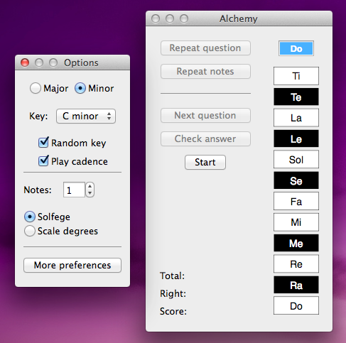

# [Alchemy](http://www.alchemyeartraining.com)

An ear training app for OS X that implements the Charlie Banacos-style ear training exercise for single and multiple
simultaneous notes.  There is a video demo of the program in action on the [website](http://www.alchemyeartraining.com) if you'd like to see what it does.

To build it, download the zip file or clone it with `git`.  Then open the XCode project, select Run or Build, and cross your fingers.  The app will also be available soon from the Mac App Store.

The [documentation](http://www.alchemyeartraining.com/help.html) includes a brief
[primer](http://www.alchemyeartraining.com/method.html) on basic music theory and how the exercise works, as well as a
[page](http://www.alchemyeartraining.com/manual.html) on how to use the program.  The documentation is not complete yet,
but hopefully the program is intuitive enough to use without a manual.  There are several resources online explaining
the ear training exercise itself.

Please [e-mail](mailto:support@alchemyeartraining.com) me with any questions, comments, or suggestions.  Thanks for
taking the time to check out my project.
