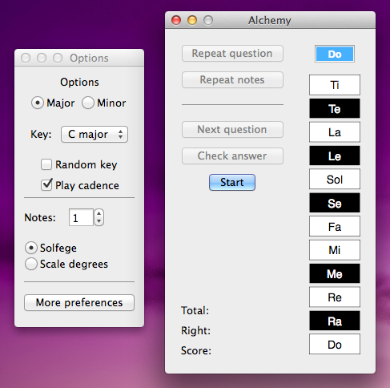

# Alchemy Ear Training Using the program

# Getting Started
  When you first open the program, your screen will look like this:
  

  
  At first, we'll only worry about the window on the right.  The program is ready to use right out of the box, so
  let's move on.

# Your first exercise
  After opening the program, press Enter or click the "Start" button.  You'll hear a cadence followed by a random
  single note.  By default, the program will only play diatonic notes but you can change that later in the
  preferences.

  After you hear the note, select the note that you think it is by clicking on the corresponding note button.  Your
  selection will be highlighted in blue.  If you need to hear the note again, click "Repeat notes".  If you'd like
  to hear both the cadence and note again, click "Repeat question".  

  When you think you've selected the right note, press Space or click the "Check answer" button.  The program will
  tell you if you got the note right by highlighting it in green and playing the next exercise.  If you got it
  wrong, it will be highlighted in red and you will not move to the next exercise.  In order to move on, you need to
  get the answer completely right.  But if you're stumped and want to move on anyway, click "Next question" and the
  answer will be highlighted in orange and the program will play the next question. 

  In the lower left corner of the main window, the program keeps track of your score for the current session.  This
  is simply the number of correct answers divided by the total number of questions.  

# Getting the most out of the program
## Note selection
   When you feel you've mastered the diatonic notes, it's time to add some chromatic ones.  Or, if you feel overwhelmed
   by all the diatonic notes, you can tell the program to only choose from certain ones.  To make changes to the notes
   the program selects randomly from, click the "More preferences" button or go to "EarTraining" > "Preferences" in the
   menu bar.
   

   This will open the preferences window, where you can select which notes the program will choose from when it
   plays random notes.  There are different sets of preferences for major and minor keys.  By default, only the
   diatonic notes are selected in each key.  To make changes, click on a note to turn it either on or off.  Notes
   that are "on" are surrounded by a gray oval.  Notes that are off are just on a white background.  Here's an
   example:  (((animated gif of selecting/deselecting notes)))

   When you're done making changes, click "Save preferences" and then click "Close".  This will save the changes
   you made and on all the following questions, the program will choose notes randomly according to your
   preferences.  If you quit and reopen the program, your changes will still be saved, so there's no need to adjust
   your preferences every time you use the program. 

## Moving beyond one note
   Once you've mastered all the chromatic notes, it's time to start hearing more than one note at once.  To do
   this, look in the options panel for this part:  (((screenshot with notes field and selectors circled)))
   
   The little up and down arrow keys let you select how many notes you want to practice with.  The default of
   course is one.  With the program, you can practice with up to 8 notes simultaneously.  When moving from one note
   to two and beyond, it's often helpful to change your note choice preferences so that the program is only
   choosing from diatonic notes again.  Then, when you are comfortable hearing multiple notes, add the chromatic
   notes one at a time.

## Minor key
So far, we've only used the program to play questions in major keys.  It's important to also practice in minor
keys.  To do this, simply select the "Minor" button in the options panel.  Remember that you have a separate set
of preferences for minor keys, so you can adjust them without affecting your choices for the major keys.    

## Turning off the cadence
One way to make these exercises more difficult is to not hear the cadence every time.  This forces you to retain
the sound of the key in your mind over a longer period of time.  It becomes very difficult to do when you're
practicing with multiple notes chosen from all diatonic and chromatic notes.

To have the program stop playing the cadence before every question, click the "Play cadence" checkbox so that it
is no longer checked.  Now the program will only play the notes when you move on to each new question.  If you
need a reminder of the key, just click "Repeat question" at any point and you will hear the cadence again,
followed by the notes.  

# Quick reference
## Options panel
Several screenshots here of the options panel.  When explaining each feature, use the screenshot with a big red circle
or something highlighting the particular feature.
   
## More preferences
Same idea here.  But probably just one screenshot is necessary

## Keyboard shortcuts

| Function      |   Key   |
 ---------------|---------|
Start	        |  Enter  |
Check answer    |  Space  |
Next question   |Backspace|
Repeat notes    |   V	  |
Repeat question |   C	  |
